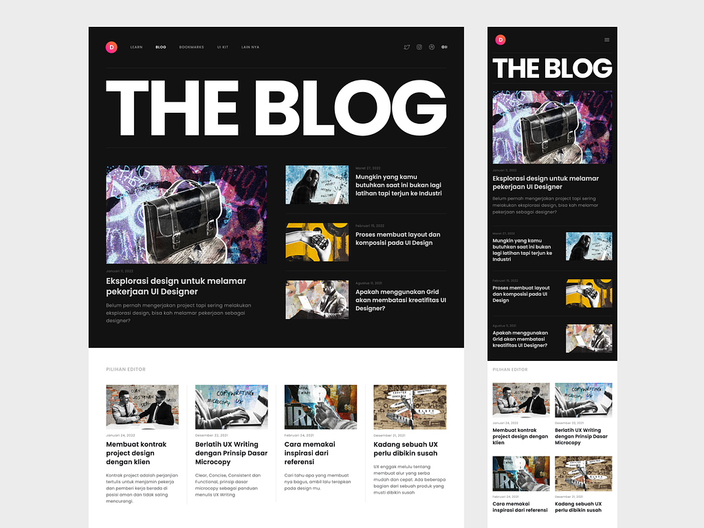

# Blog

Este blog foi criado inteiramente através do BOOTCAMP SANTANDER. Criei o blog utilizando o framework Angular com base no que aprendi no BOOTCAMP. O design da página foi inspirado no site Dribbble, e eu tentei seguir fielmente esse design. Todos os componentes que puderam ser reutilizados foram reutilizados na criação da página.

## Exemplo da página

## Tecnologias usadas

- [x] HTML
- [x] CSS
- [x] TypeScript

### Frameworks

- [x] Angular
